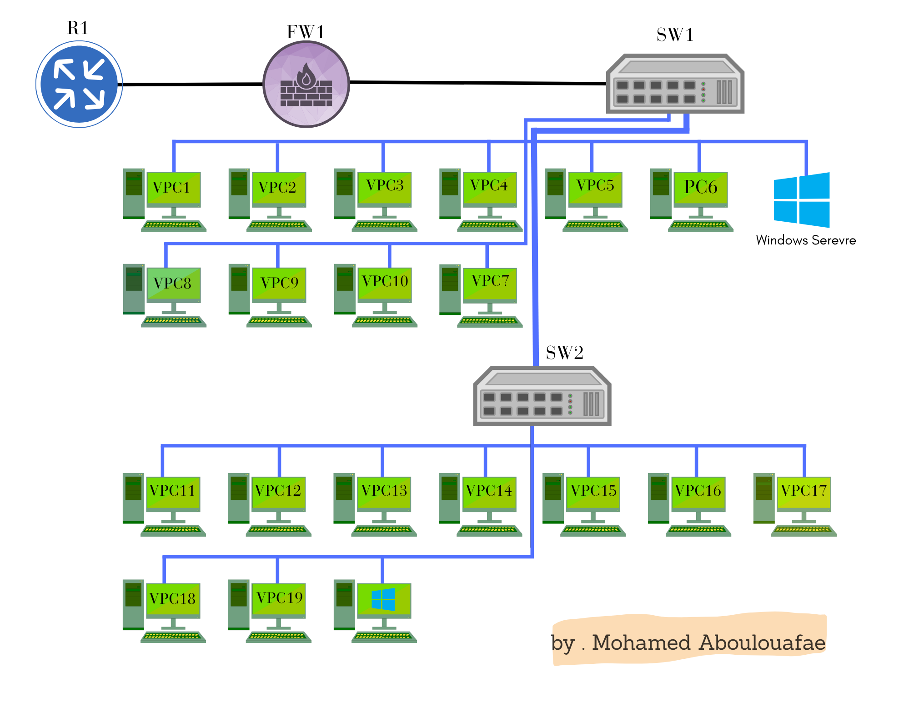
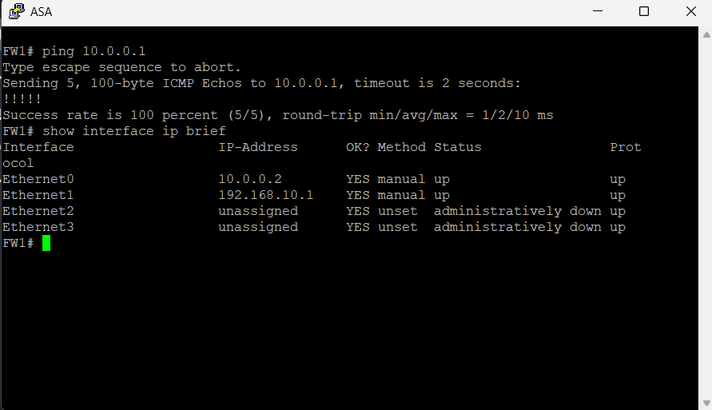
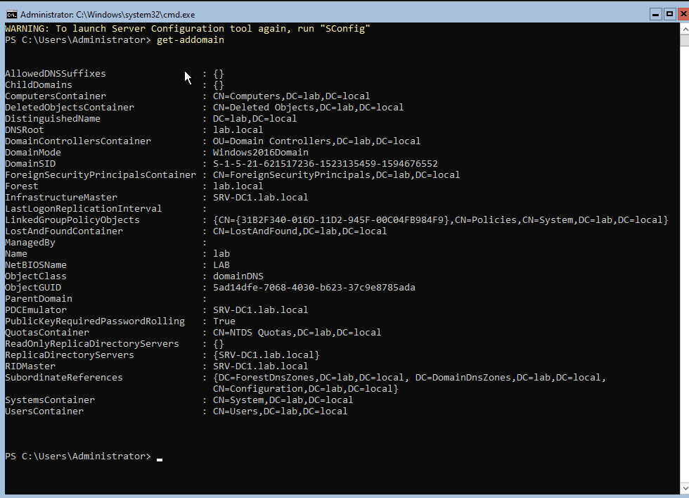
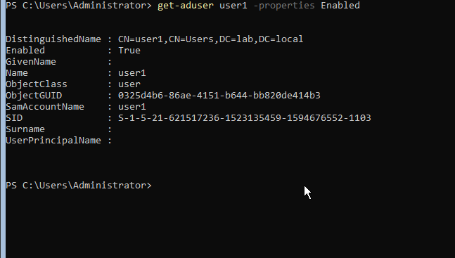
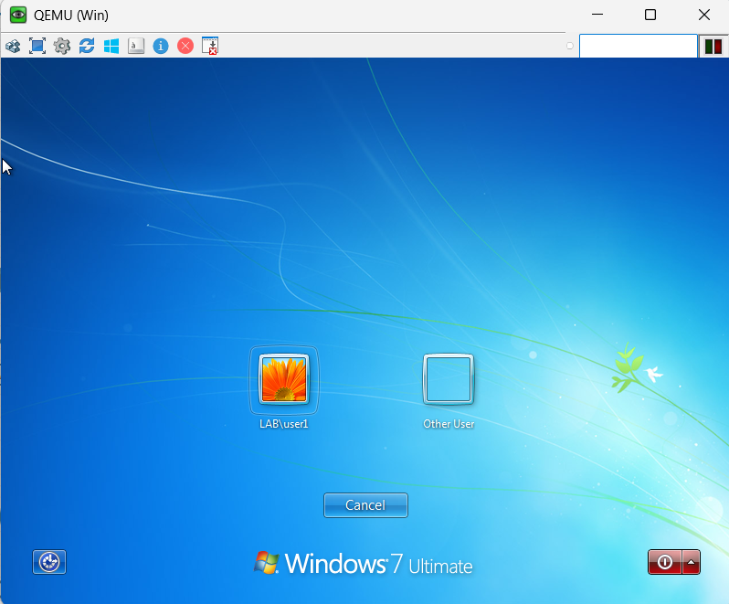
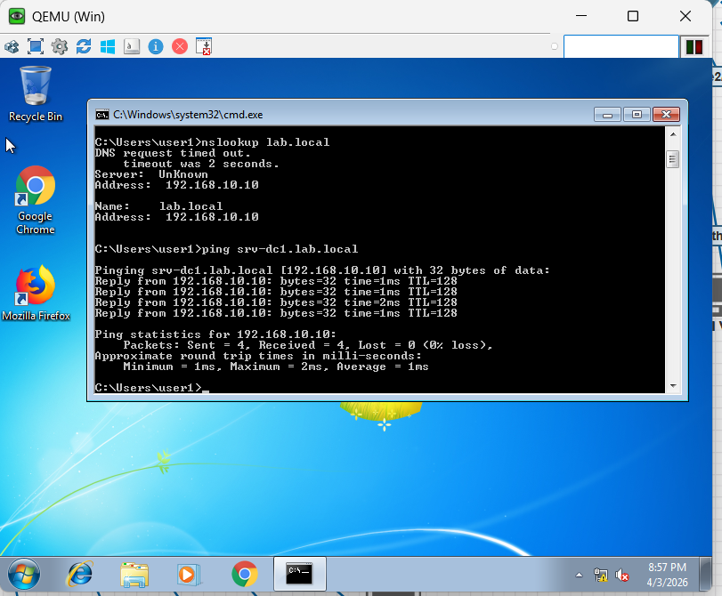

# AD + ASA + EVE-NG Lab

This project documents a small enterprise-style lab built in EVE-NG using:

- Cisco vIOS Router
- Cisco ASA Firewall
- SW1 / SW2
- Windows Server 2022 Core
- Windows client
- Active Directory Domain Services
- DNS

## Objectives

- Build router and firewall connectivity
- Provide internal LAN communication
- Deploy Windows Server Core
- Promote the server to Domain Controller
- Configure DNS
- Create domain users
- Join a Windows client to the domain

## Topology

### Designed topology

### EVE-NG implementation

## IP Plan

### WAN Segment
- R1 GigabitEthernet0/0: `10.0.0.1/30`
- ASA Ethernet0 (outside): `10.0.0.2/30`

### LAN Segment
- ASA Ethernet1 (inside): `192.168.10.1/24`
- SRV-DC1: `192.168.10.10/24`
- Windows Client: `192.168.10.20/24`

### DNS
- Preferred DNS for all domain members: `192.168.10.10`

### Domain
- FQDN: `lab.local`
- NetBIOS: `LAB`

## Configurations

- Router base config: `configs/router/r1-base-config.txt`
- ASA base config: `configs/asa/asa-base-config.txt`
- Windows Server Core AD commands: `configs/windows-server/powershell-ad-commands.md`

## Documentation

- IP plan: `docs/ip-plan.md`
- Implementation steps: `docs/implementation-steps.md`
- Screenshots index: `docs/screenshots/README.md`

## Validation Screenshots

### ASA connectivity

### Server Core domain validation

### User validation

### Domain login validation

### DNS resolution

 ===============================================
# NOTES
 ===============================================
 
# - This project documents a working small enterprise AD lab.
# - Windows Server was deployed as Server Core.
# - Active Directory and DNS were configured successfully.
# - A Windows client joined the lab.local domain successfully.
# - User authentication was validated through domain login.
# - OU and GPO steps can be added later as future improvements.

# =========================================================
# LICENSE
# =========================================================

# This repository includes documentation and configuration files only.
# It does not include ISO images, QEMU images, Cisco images,
# or any licensed VM files.
